# Sistema de resolução de conflito com cartas

Resolução de conflitos, principalmente combates, em RPG são resolvidos normalmente com dados. Regras com dados apresentam uma serie de problemas 
que um sistema de cartas poderia resolver.

## 1 - Requisitos

### 1.1 - Rapido
Cada rodada tem que ter a possibilidade de ser rapida e deve resolver um topico de um conflito ou problema. Num combate, por exemplo, seria um golpe. Um
conjunto de rodadas é uma partida, e uma partida representa uma cena (por exemplo, todo um combate do inicio ao fim).

### 1.2 - Bonus e desvantagens tem que poder ser aplicados externamente
O mestre tem que ter a capacidade de facilitar ou dificultar as jogadas para representar graus de experiencia ou dificuldade.

### 1.3 - Diversificado
Deve ser possivel diversas estrategias diferentes no uso das cartas.

### 1.4 - Simples
As regras devem ser poucas e faceis.

## 2 - Pontos de inspiração

Alem das cartas outros itens fazem parte do sistema. Cada pessoa possui uma quantidade de pontos de inspiração. Esses pontos tem varias funções.

Essa é uma forma de atender o requisito de vantagem / desvantagem: a quantidade de pontos aumenta com a experiencia do jogador, e pode ser penalizada
(ex: penalidade de -2 pontos faz o jogador ter q usar 2 pontos a menos do que tem, bonus temporario de 2 pontos faz o jogador poder usar 2 a mais). 

## 3 - Iniciativa

Na primeira rodada as ações seriam simultaneas, a nao ser que um ou os dois jogadores queiram conquistar a iniciativa.

Para conquistar a iniciativa, os jogadores apostam pontos de inspiração. 

Separa-se na mão sem deixar o adversario perceber quantos pontos se quer apostar.

A quantidade maxima de pontos a apostar é 3 (exceto com bonus / penalidades - bonus podem ser permanentes como forma de indicar poder de oponente ou jogador,
e nesse caso o limite é maior. O limite de um jogador nao altera o limite do outro).

Os dois revelam a quantidade ao mesmo tempo. Os resultados dependem de:

### Ambos querem a iniciativa

Aquele que apostou mais ganha a iniciativa, e descarta os pontos usados, com efeito para a partida atual 
(numa proxima rodada ele tera pontos a menos, mas numa proxima partida pode usar todos os pontos novamente, exceto bonus temporarios, que sao por partida).

O que perdeu nao tem a iniciativa, mas pega os pontos de volta e pode usar na mesma partida.

### Somente um quer a iniciativa

Se um dos jogadores somente quiser a iniciativa, somente ele pode recebe-la. O outro jogador, mesmo que vença, apenas mantem as ações simultaneas, 
e perde metade dos pontos de inspiração usados, arredondado pra baixo, caso vença.

Um jogador deve jogar mesmo que nao queira a iniciativa (para tentar manter as ações simultaneas).

### Empate, nos dois casos
No empate ambos pegam os pontos de volta e as ações voltam a ser simultaneas, o que cancela a iniciativa de um jogador que ja a tenha anteriormente.

### Efeito da iniciativa
O jogador que tem a iniciativa joga DEPOIS (ele pode ver a jogada do adversario primeiro e escolher as cartas depois), mas considera-se apos a sua jogada que 
sua ação ocorre ANTES da do adversário.

## 4 - Cartas

Cada carta tem um simbolo, e o conjunto deles funciona como pedra-papel-tesoura, mas temos cinco simbolos em vez de 3: agua, madeira, fogo, terra, metal (ar). 

Os elementos vencem uns aos outros, em ataque, nessa ordem, e metal vence a agua.

No entanto, pode-se deixar as cartas na horizontal (tap) e elas entram em modo de defesa, e ai os elementos vencem uns aos outros na ordem reversa, e a agua 
vence o metal.

Existe também a relação de dominação, em q um elemento vence aquele que esta duas casas adiante na lista (e no tap, da mesma forma, a relação se inverte para 
vencer aquele que está duas casas atras na lista.

O seguinte grafico explicativo estará em todas as cartas (ou no verso delas):

## 5 - Pool

Cada jogador tem uma quantidade de cartas que tira do seu baralho e coloca abertas na sua frente. Esse é o pool de cada jogador. A quantidade de cartas no pool
também pode ser usada para bonus / penalidade temporarios e representa experiencia / força. Não se pode ter pool menor do que 1 carta.

Um jogador iniciante (de "1o nivel" no D20) poderia ter um pool de 1 carta e o pool pode ir aumentando com a experiencia.

## 6 - Funcionamento basico do sistema

### Sem iniciativa (simultaneo)

Os jogadores colocam tokens de escolha, virados pra baixo, sobre as cartas, sem deixar o adversario ver. Apenas um dos tokens indica "carta escolhida".

Os tokens são virados e as cartas escolhidas produzem efeito.

### Com iniciativa 

O jogador sem iniciativa indica a carta que escolheu, e tem que escolher ataque ou defesa (tap) antes do outro também.

O jogador com iniciativa joga em seguida.

### Efeitos

As cartas vencem de acordo com o diagrama de geração / dominação, e modificadores. Cartas iguais empatam.

Vencer a rodada tem as implicações da regra do jogo que se esteja usando (por exemplo, causar dano no adversario, com todas as regras que se aplicarem -
redução de dano, p ex).

Se as duas cartas são de defesa, ocorre empate automatico, nao importando as relacoes entre as cartas.

Se uma delas é de defesa, ela pode defender somente a geracao e a dominicação. Por exemplo, se um jogador ataca com branco, ele pode ser defendido
somente por amarelo ou vermelho. No caso de defesa, pode-se considerar que o ataque falha, ou que tem menor efeito, de acordo com o que se quiser fazer
no jogo.

Se as duas cartas são de ataque, pode-se considerar que o efeito do ataque vencedor é maior e do perdedor menor, ou considerar que somente o ataque vencedor
ocorre, de acordo com o que se quiser fazer no jogo. Por exemplo, um ataque de uma carta de fogo vence um ataque de terra ou de ar (vence o de terra, e domina
o de ar, que quer dizer somente que vence o de ar também - apenas terminologia).

## 6 - Pontos de reforço

No inicio de cada partida os jogadores ganham pontos de reforço. Os pontos são coloridos, cada um representando um elemento das cartas.

O padrão é ganhar um ponto de cada cor, mas isso também pode ser usado para modificar com bonus / penalidades, e também representar experiencia e poder.

Os pontos de reforço modificam os resultados da rodada.

Os pontos podem voltar para o pool ou serem capturados pelo vencedor apos uma rodada.

O vencedor pode pegar os pontos nas cartas vencidas se quiser e acrescentar no proprio pool de pontos da partida, mas cede a iniciativa se quiser fazer isso.

O jogador pode fazer algumas coisas com os pontos de reforço:

### Reforçar uma carta

Qualquer numero de pontos (todos da mesma cor que a cor da carta) podem ser acrescentados numa carta. Isso tem os seguintes efeitos:

#### Cartas iguais

Quantidade maior de pontos dá a vitoria para uma carta

#### Cartas diferentes

A relação de dominação se inverte e passa a ser de contra-dominação (as setas que vão de 2 em 2 no ataque passam a ser iguais a da defesa, e na defesa
passam a ser iguais ao ataque, mas isso ocorre somente se a carta usada tiver mais pontos do que a outra.

Por exemplo, um ataque de agua sem pontos venceria um ataque de madeira ou fogo, mas se a carta de fogo tiver um ponto de fogo, ela passa a vencer por
contra-dominação (usa a relacao de defesa em vez de ataque como referencia, mas ainda é um ataque). Mas se a carta de agua tiver um ponto de agua, isso
nao ocorre e ela continua vencendo uma carta de fogo, mesmo que a de fogo tenha um ponto de fogo.

outro exemplo: um ataque de madeira poderia ser defendido somente por uma defesa de fogo ou de terra, mas uma carta de ar que tenha um ponto de ar pode
defender um ataque de madeira (usa a relação de dominação do ataque, mas ainda é uma carta de defesa). No entanto, se a carta de madeira tiver um ponto
de madeira, isso não acontece, mesmo que a carta de ar tenha um ponto de ar.

Conta-se a diferença de pontos, entao uma carta com dois pontos permite usar o efeito de contra-dominação com uma de menos pontos.

### Criar uma carta virtual

Pode-se virar uma carta (fecha-la, deixar com face para baixo) e colocar um ponto ou mais da mesma cor, e a carta se torna uma daquele tipo.

## 7 - Apostas

Por fim, os jogadores podem apostar pontos de inspiração ou de reforço. Colocam-se qualquer quantidade de pontos
